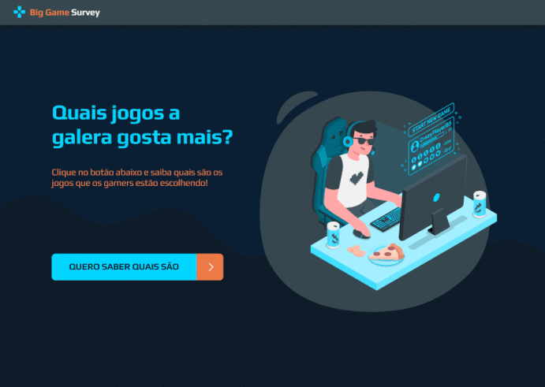

<h1 align="center">
    
</h1>

<p align="center">
    
    
</p>

<p align="center">
    <a href="#-sobre">Sobre</a>&nbsp;&nbsp;&nbsp;|&nbsp;&nbsp;&nbsp;
    <a href="#-tecnologias">Tecnologias</a>&nbsp;&nbsp;&nbsp;|&nbsp;&nbsp;&nbsp;
    <a href="#-preview">Preview</a>&nbsp;&nbsp;&nbsp;|&nbsp;&nbsp;&nbsp;
    <a href="#-instalação">Instalação</a>&nbsp;&nbsp;&nbsp;|&nbsp;&nbsp;&nbsp;
    <a href="#-licença">Licença</a>
</p>

## 📋 Sobre
O Big Game Survey é uma aplicação que realiza uma pesquisa por meio do mobile, e entrega os dados dessa pesquisa por meio da aplicação web, fornecendo gráficos dinâmicos.

## 🚀 Tecnologias
Foram utilizadas as seguintes tecnologias:

- [Java](https://www.oracle.com/br/java/)
- [Spring Boot](https://spring.io/projects/spring-boot)
- [React](https://reactjs.org)
- [React Native](https://facebook.github.io/react-native/)
- [Expo](https://expo.io/)
- [TypeScript](https://www.typescriptlang.org/)

## 📷 Preview


## 💾 Instalação
Este é um monorepositório, portanto possui as fontes do projeto web, api e mobile. Para executa-lo, é necessário utilizar, ou o npm, ou o yarn, e também instalar as dependências de cada parte do projeto separadamente.

**Web:**
```bash
> cd big-game-survey/front-web
> npm install
```

Após instalar as dependências:
```bash
> npm run start
```

**Back-End**
Inicie por meio do Spring Tool Suite 4 o servidor.

**Mobile**
```bash
> cd big-game-survey/front-mobile
> npm install
```


Após instalar as dependências:
```bash
> npm run start
```

## 📝 Licença
Esse projeto está sob a licença [MIT](./LICENSE). 
